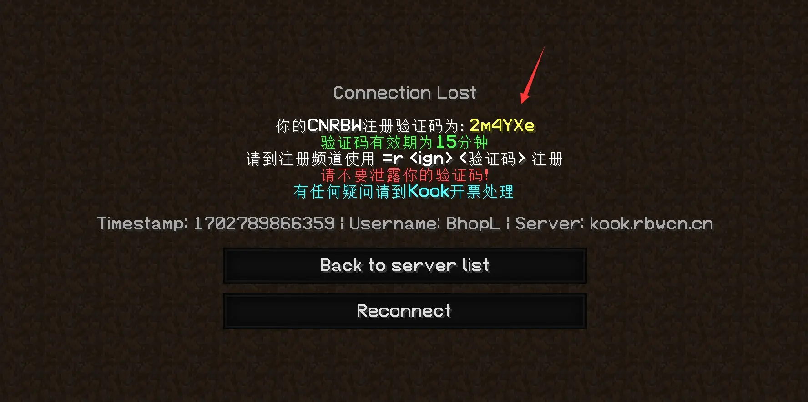

# 如何注册中国排位起床社区服务器
1.使用 **1.8或以上**  Minecraft客户端进入`auth.cnrbw.net`服务器获取验证码
<body>

2.在(chn)6933225103010000(chn) 输入`=r 游戏名字 验证码` 进行注册, **1.8或以上**
例如:=r Mino 12345
(**另外因KOOK问题，注册完成后需刷新一下KOOK或者重启KOOK才能看见排队频道**)
